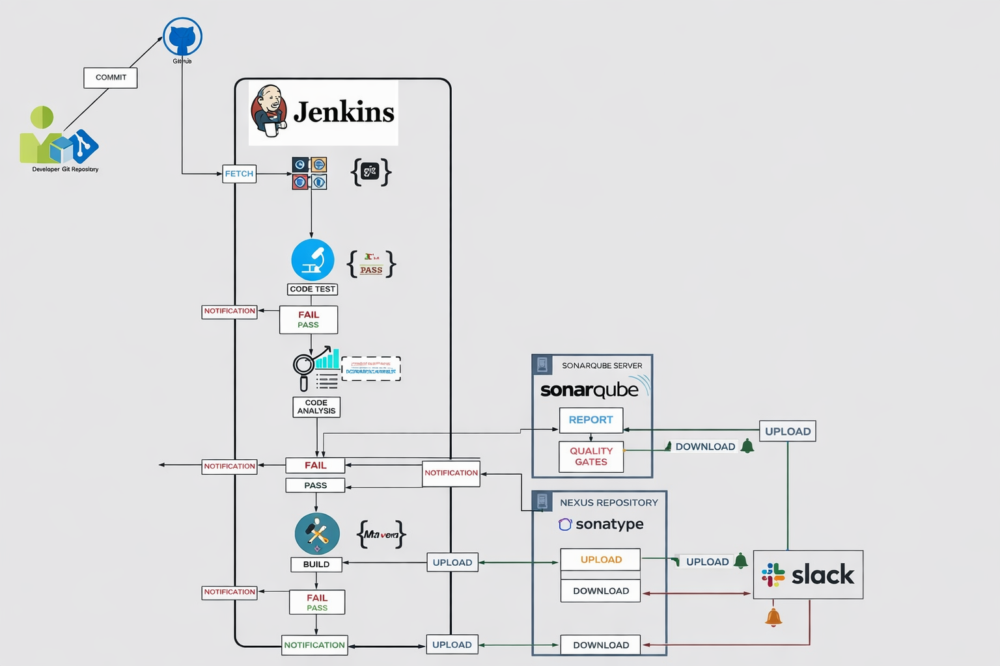

# Continuous Integration Pipeline using Jenkins, SonarQube, Nexus and slack


---

## 📌 Project Overview

This project demonstrates a complete **Continuous Integration (CI) pipeline** using:

- Jenkins
- SonarQube
- Nexus Repository
- Maven
- Slack Notifications
- GitHub Webhooks
- AWS EC2

The pipeline automates the software delivery workflow from code commit to artifact storage with integrated quality analysis and notification mechanisms.

The goal of this project is to simulate a **real-world enterprise CI workflow** used by DevOps teams for maintaining software quality, artifact traceability, and build automation.

---

# 🚀 Architecture

## High Level CI Workflow



---

# ⚙️ Tech Stack

| Tool | Purpose |
|---|---|
| Jenkins | CI Orchestration |
| GitHub | Source Code Management |
| Maven | Build & Dependency Management |
| SonarQube | Static Code Analysis |
| Nexus Repository | Artifact Storage |
| Slack | Notifications |
| AWS EC2 | Infrastructure Hosting |
| Java | Application Runtime |

---

# 📂 Repository Structure

```bash
jenkins-sonarqube-nexus-ci/
│
├── Jenkinsfile
├── pom.xml
├── settings.xml
├── README.md
│
├── userdata/
│   ├── jenkins.sh
│   ├── nexus.sh
│   ├── sonarqube.sh
│   └── sonar-analysis-properties
│
├── docs/
│   ├── architecture.md
│   ├── jenkins-setup.md
│   ├── sonarqube-setup.md
│   ├── nexus-setup.md
│   ├── webhook-configuration.md
│   └── troubleshooting.md
│
├── screenshots/
│   ├── architecture_diagram.png
│   ├── aws-console.jpg
│   ├── pipeline-stages.jpg
│   ├── pipeline-success.jpg
│   ├── sonarqube-main.jpg
│   ├── sonarqube-status.jpg
│   ├── nexus-home.jpg
│   └── nexus-repo.jpg
│
└── src/
```

---

# 🔄 CI Pipeline Flow

```text
Developer Commit
       ↓
GitHub Webhook Trigger
       ↓
Jenkins Pipeline Starts
       ↓
Checkout Source Code
       ↓
Maven Build
       ↓
Unit Testing
       ↓
Checkstyle Analysis
       ↓
SonarQube Code Analysis
       ↓
Quality Gate Validation
       ↓
Artifact Packaging
       ↓
Upload WAR/JAR to Nexus
       ↓
Slack Notification
```

---

# 🖥️ Infrastructure Setup

Three separate EC2 instances were provisioned in AWS:

| Server | Purpose |
|---|---|
| Jenkins Server | CI Pipeline Execution |
| SonarQube Server | Static Code Analysis |
| Nexus Server | Artifact Repository |

---

# 📸 Screenshots

## AWS EC2 Infrastructure


---

## Jenkins Pipeline Execution


---

## Successful Pipeline Execution


---

## SonarQube Dashboard


---

## SonarQube Quality Gate


---

## Nexus Repository Manager


---

## Uploaded Artifacts in Nexus


---

# 🧪 Jenkins Pipeline Stages

## 1. Checkout SCM
Fetches source code from GitHub repository.

## 2. Tool Installation
Ensures Maven, JDK, and Sonar Scanner are available.

## 3. Build
Compiles the application using Maven.

## 4. Test
Executes unit tests.

## 5. Checkstyle Analysis
Performs coding standard validation.

## 6. SonarQube Analysis
Scans source code for:
- Bugs
- Vulnerabilities
- Code smells
- Technical debt

## 7. Quality Gate
Ensures code meets defined quality thresholds before proceeding.

## 8. Upload Artifact
Publishes generated WAR/JAR files into Nexus Repository.

## 9. Slack Notification
Sends build success/failure notifications to Slack channels.

---

# 📊 SonarQube Metrics

The pipeline integrates SonarQube quality gates to enforce:

- Reliability
- Maintainability
- Security
- Code Smells Detection
- Vulnerability Detection
- Duplication Analysis

SonarQube provides centralized visibility into overall code health.

---

# 📦 Nexus Repository Usage

Nexus Repository is used for:

- Artifact versioning
- Build traceability
- Centralized package storage
- Deployment-ready artifact management

Generated Maven artifacts are uploaded automatically after successful pipeline execution.

---

# 🔔 Slack Integration

Slack notifications are configured to provide:

- Build success alerts
- Build failure alerts
- Pipeline status updates
- Quality gate failure notifications

This improves team visibility and rapid issue detection.

---

# 🎯 Why This Project?

This project was built to demonstrate:

- Real-world CI implementation
- Enterprise DevOps workflow understanding
- Build automation
- Static code analysis integration
- Artifact lifecycle management
- Jenkins pipeline orchestration
- AWS infrastructure provisioning
- DevOps monitoring and notifications

It showcases practical DevOps engineering skills commonly expected in production environments.

---

# 🔐 Security & Best Practices

- Jenkins credentials stored securely
- GitHub webhook automation enabled
- Quality gates enforced before artifact upload
- Separate EC2 instances for isolation
- Artifact versioning enabled in Nexus
- Automated notifications integrated

---

# 📈 Future Enhancements

- Dockerize the application
- Integrate Kubernetes deployment
- Add Terraform for infrastructure provisioning
- Add Prometheus & Grafana monitoring
- Implement GitOps using ArgoCD
- Add Trivy security scanning
- Integrate OWASP Dependency Check
- Enable automated deployment to Kubernetes
- Add multi-branch Jenkins pipelines
- Configure Jenkins Shared Libraries

---

# 🧠 Key DevOps Concepts Demonstrated

- Continuous Integration (CI)
- Infrastructure Provisioning
- Build Automation
- Static Code Analysis
- Artifact Repository Management
- Pipeline Orchestration
- Quality Gates
- Webhook Automation
- DevOps Monitoring
- Notification Systems

---

# 🏁 Conclusion

This repository demonstrates a production-style Continuous Integration workflow using industry-standard DevOps tools. The implementation focuses on automation, quality validation, artifact management, and scalable CI practices widely adopted in enterprise software delivery pipelines.

---

# 👨‍💻 Author

Joseph M J

- GitHub: https://github.com/josephmj0303
- LinkedIn: https://www.linkedin.com/in/josephmj-devops/
